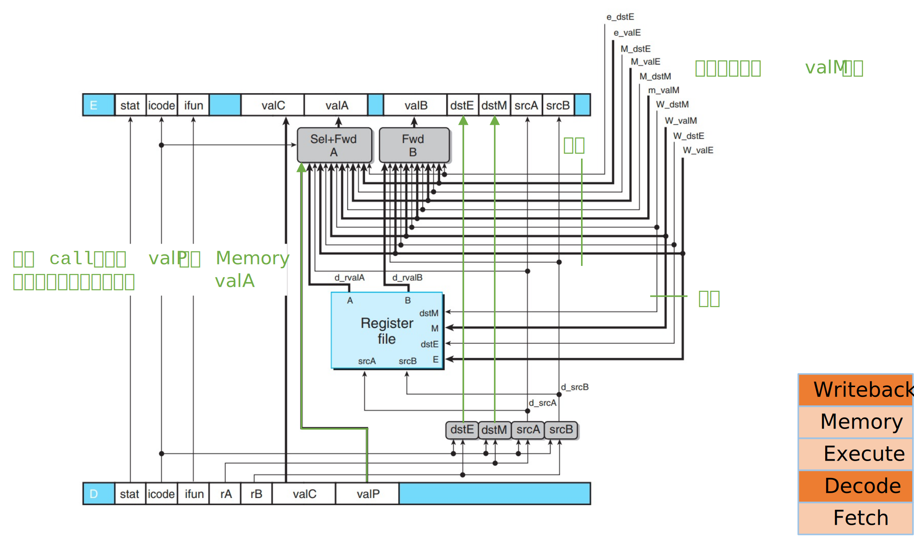

# 2025-Fall-ICS-TA
Fully handmade slides for students in section 23, under active update🔥.

## Lecture Slides
| Week   | Topic                                  |Content|Snapshot|
|--------|----------------------------------------|-------------------------------|-------|
| Week 1 | Welcome|Course Overview| |
| Week 2 | Representation|Bits & Integers, Floating Points||
| Week 3 | Compilation System I|Machine-Level Programming: Basics & Control||
| Week 5 | Compilation System II, III|Machine-Level Programming: Procedure, Data & Advanced||
| Week 7 | Processor Arch I|ISA & Logic, Sequential Processor||
| Week 8 | Processor Arch II|Pipelined Processor||