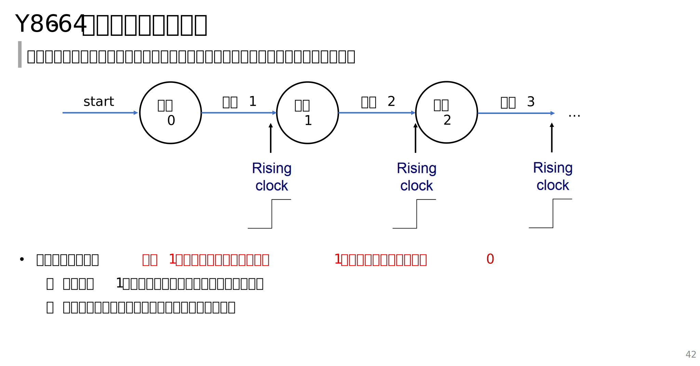

# 2025-Fall-ICS-TA
Fully handmade slides for students in section 23, mainly focusing on CSAPP3e content.

## Lecture Slides
| Week   | Topic                                  |Snapshot|
|--------|----------------------------------------|--------|
| Week 1 | Welcome||
| Week 2 | Representation||
| Week 3 | Compilation System I||
| Week 5 | Compilation System II, III||
| Week 7 | Processor Architecture: Sequential and Pipelined||
<!-- | Week 8 | Optimization, Memory and Midterm Review |
| Week 9 | Midterm Explanation                    |
| Week 10| Static Linking I                       |
| Week 11| Static Linking II and ECF              |
| Week 12| Dynamic Linking, Sys-IO & VM I         |
| Week 13| VM II and Final Review I              |
| Week 14| Computer Network I and Final Review II  |
| Week 15| Computer Network II and Final Review III  |
| Week 16| Synchronization, Final Review IV and Goodbye  | -->

